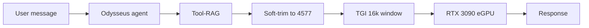

# Context window benchmark — RTX 3090 eGPU deployment

Live benchmark results for this Odysseus install on Windows 11 with an external GPU. Use this doc to understand **how much context actually fits** when serving locally — the model card may advertise 128K, but TGI/VRAM limits are often much lower.

**Benchmark date:** June 7, 2026  
**Raw data:** [`data/max_context_sweep.json`](../data/max_context_sweep.json), [`data/context_benchmark.json`](../data/context_benchmark.json)

---

## Hardware & software setup

| Component | Configuration |
|-----------|---------------|
| **Host OS** | Windows 11 |
| **GPU** | NVIDIA RTX 3090 (24 GB VRAM), eGPU over USB-C |
| **Secondary host** | 2019 MacBook Pro (16 GB RAM) — available on the same network for remote serving if needed |
| **Odysseus** | Docker Compose at `http://127.0.0.1:7000` |
| **LLM server** | `F:\Github Projects\LLM-Local` — `vllm-server` container (TGI) at `http://127.0.0.1:8000` |
| **Model** | `Qwen/Qwen2.5-Coder-7B-Instruct` |
| **Endpoint in Odysseus** | `http://host.docker.internal:8000/v1` |
| **Workspace mount** | `C:/Users/compc/Desktop` → `/workspace` in the Odysseus container |
| **Agent test folder** | `C:\Users\compc\Desktop\test workspace` → `/workspace/test workspace` |

### Before vs after (LLM-Local `docker-compose.yml`)

| Setting | Original | Max stable (applied) |
|---------|----------|----------------------|
| `MAX_TOTAL_TOKENS` | 8,192 | **16,384** |
| `MAX_INPUT_LENGTH` | 4,096 | **8,192** |
| `MAX_BATCH_PREFILL_TOKENS` | 4,096 | **8,192** |

Compose backup: `F:\Github Projects\LLM-Local\docker-compose.yml.bak-maxcontext`

---

## How the benchmark was run

Two scripts in `scripts/`:

1. **`find_max_context.py`** — Sweeps TGI context limits on the LLM-Local compose file, restarts `vllm-server` at each level, and checks server health, inference, GPU memory, and empirical max input via binary search.
2. **`benchmark_context.py`** — Probes the running server’s `/info` limits and measures plain-chat vs agent-style prompt overhead.

```powershell
cd odysseus
venv\Scripts\python scripts\find_max_context.py
venv\Scripts\python scripts\benchmark_context.py --base-url http://127.0.0.1:8000/v1 --agent-sim
```

Each sweep level was considered **stable** only if the container started, quick inference returned HTTP 200, and empirical max-input probing succeeded without OOM.

---

## Sweep results (all levels passed)

| `max_total` | `max_input` | Empirical max input | GPU used | GPU free |
|-------------|-------------|---------------------|----------|----------|
| 8,192 | 4,096 | 3,848 | 21,889 MiB | 2,438 MiB |
| 9,216 | 4,608 | 4,325 | 21,844 MiB | 2,483 MiB |
| 10,240 | 5,120 | 4,802 | 21,646 MiB | 2,681 MiB |
| 11,264 | 5,632 | 5,280 | 21,691 MiB | 2,636 MiB |
| 12,288 | 6,144 | 5,757 | 21,726 MiB | 2,601 MiB |
| 14,336 | 7,168 | 6,712 | 21,042 MiB | 3,285 MiB |
| **16,384** | **8,192** | **7,667** | **21,060 MiB** | **3,267 MiB** |

**Maximum stable configuration:** 16,384 total / 8,192 input. Levels above 16K were not tested in this sweep; ~3.3 GB VRAM remained free at 16K.

> **Note:** An older comment in LLM-Local compose mentioned 12,288+ causing OOM on a prior setup. On this RTX 3090 eGPU path, 12K–16K all passed. Your mileage may vary with different eGPU enclosures, drivers, or concurrent GPU use.

---

## Usable token budgets (after tuning)

Calibrated at **9.32 chars/token** from the live server. Probes reserve **512 tokens** for the model reply.

| Mode | Max input tokens | Practical guidance |
|------|------------------|-------------------|
| **Plain chat** | **~7,667** | Long conversations and large pasted context fit much better than at 8K total. |
| **Agent (simulated preamble)** | **~4,577** user budget | After ~2,834 tokens of simulated tool/system overhead. |
| **Odysseus agent (live)** | Works at 16K | Tool-RAG selects a subset of tools; soft-trim enforces budget. Verified with a one-word reply test. |

### Odysseus setting applied

In `data/settings.json`:

```json
"agent_input_token_budget": 4577
```

Odysseus reads TGI `/info` for `max_total_tokens` (16,384) via `src/model_context.py`, so the UI and agent loop see the real serving limit instead of the model card’s theoretical window.

---

## Why agent mode was tight at 8K

Agent mode spends context on more than the user message:

| Component | Estimated tokens |
|-----------|------------------|
| Full fenced-block system prompt (all tools) | ~9,667 |
| Compact system prompt (native tool calling) | ~4,352 |
| All 65 native tool schemas | ~13,778 |

At **8,192 total tokens**, even the system prompt alone could exceed the window. At **16,384**, Odysseus can run agent mode when:

- **Tool-RAG** retrieves only relevant tools (e.g. ~36 for a simple query, not all 65).
- **Soft-trim** caps history to `agent_input_token_budget` (4,577).
- The endpoint has **`supports_tools=true`** so Qwen2.5 uses compact prompt + native schemas.

Example from a live agent turn:

```
[tool-rag] Retrieved tools for query: [... 15 extra tools ...]
[agent] soft-trimmed context: 4944 -> 667 tokens (budget=4577, reserve=1024)
Agent round 1: "Hello."
```

**Latency:** First agent response with many tool schemas can take several minutes over the eGPU USB-C path — separate from the context limit, but worth expecting on cold prefill.

---

## Bottleneck summary



1. **Serving stack cap** — TGI `max_total_tokens` (now 16,384) is the hard ceiling, not the model’s 128K card spec.
2. **Agent tool overhead** — Largest software bottleneck; full tool list does not fit without Tool-RAG.
3. **eGPU bandwidth** — USB-C prefill can be slow with large tool schemas.

---

## Using agent mode on this setup (browser → files on Desktop)

1. Open `http://127.0.0.1:7000`
2. Switch to **Agent** mode (not Chat)
3. Enable **Shell** (terminal icon in the composer — on by default in Agent mode)
4. Set workspace: **+** menu → **Workspace** → browse starts at `/workspace` (your Desktop) → open **`test workspace`** → **Use this folder**
   - Or slash command: `/workspace set /workspace/test workspace`
5. **New chat**, then ask e.g. *Create a React app named my-app in this workspace*
6. Wait for tool runs (`bash`, `npx`, etc.) — first agent turn can take 1–5 minutes on the eGPU path

**Local TGI note:** disable **Supports tools** on the Qwen endpoint in Settings (fenced-block tools are more reliable than native JSON schemas on TGI/Outlines). This deployment has `supports_tools=false` on `http://host.docker.internal:8000/v1`.

**Node projects on Desktop:** `/workspace` is your Desktop — files you create there are already on the host. Do not move `node_modules` across the mount (slow/brittle on Windows Docker). Scaffold in the workspace (`npx create-react-app …`) or copy source + `package.json` and run `npm install` in place.

For coding tasks, keep prompts focused; history is trimmed to ~4.5K tokens for your messages

Plain **Chat** mode can use roughly **7.6K tokens** of input per turn (with ~512 reserved for the reply).

---

## Restore original LLM limits

If 16K causes instability on your machine:

```powershell
Copy-Item "F:\Github Projects\LLM-Local\docker-compose.yml.bak-maxcontext" `
          "F:\Github Projects\LLM-Local\docker-compose.yml" -Force
docker compose -f "F:\Github Projects\LLM-Local\docker-compose.yml" restart vllm-server
```

Then lower `agent_input_token_budget` in `data/settings.json` (e.g. back to **750** for the original 8K cap) and restart Odysseus:

```powershell
docker compose restart odysseus
```

---

## Re-run or extend the benchmark

To test another compose file or push beyond 16K, edit `CANDIDATES` in `scripts/find_max_context.py` and run the sweep again. Only increase limits when GPU free memory stays comfortably above ~2 GB and inference stays stable.
